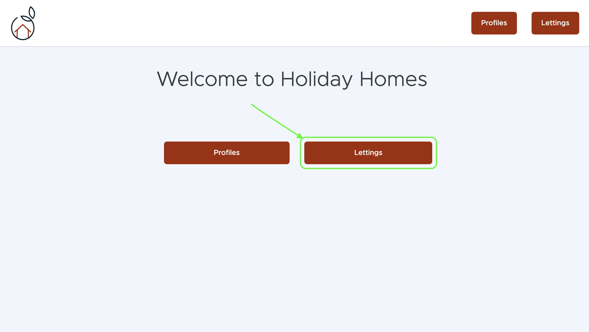

Guide d'utilisation
===================

Cette section fournit des exemples d’utilisation de l’application **Python OC Lettings FR**, que ce soit en tant qu'utilisateur ou développeur.

Accès au site
-------------

Une fois l’application déployée (ex. via Render), vous pouvez accéder aux fonctionnalités principales via l’URL publique :

- Page d’accueil : ``/``
- Liste des locations : ``/lettings/``
- Détail d’une location : ``/lettings/<id>/``
- Liste des profils : ``/profiles/``
- Détail d’un profil : ``/profiles/<username>/``

Accès à l’interface d’administration
------------------------------------

L’interface admin de Django est disponible à l’adresse :

``/admin/``

Utilisez les identifiants créés via :

.. code-block:: bash

   python manage.py createsuperuser

Elle permet de gérer les utilisateurs, profils, locations et adresses.

Création d’un profil utilisateur
--------------------------------

1. Créez un utilisateur via l’admin ou via `createsuperuser`.
2. Associez un profil utilisateur via la section *Profiles* de l’admin.
3. Un utilisateur avec un profil associé peut être consulté à l’URL :

``/profiles/<username>/``

Ajout d’une location
--------------------

1. Accédez à l’interface admin.
2. Créez une nouvelle adresse dans le module *Addresses*.
3. Créez une location dans le module *Lettings* et associez-y une adresse.
4. Elle sera visible dans la liste des locations du site.

Cas d’usage typique
-------------------

Un utilisateur visite le site et consulte une location disponible :

- Il clique sur « Lettings »

- Il accède à la fiche de la location
- Il retourne à l’accueil pour explorer les profils d’autres utilisateurs

---
